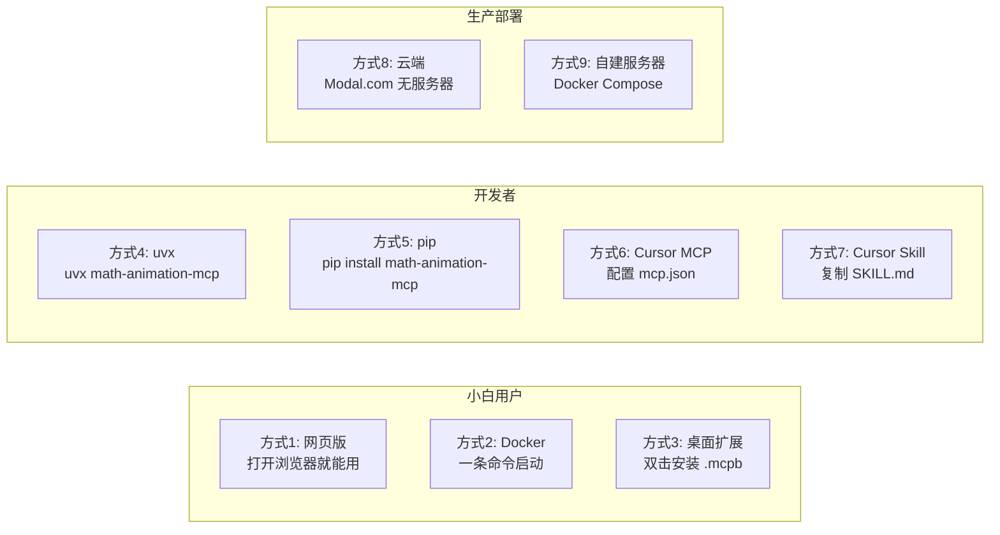
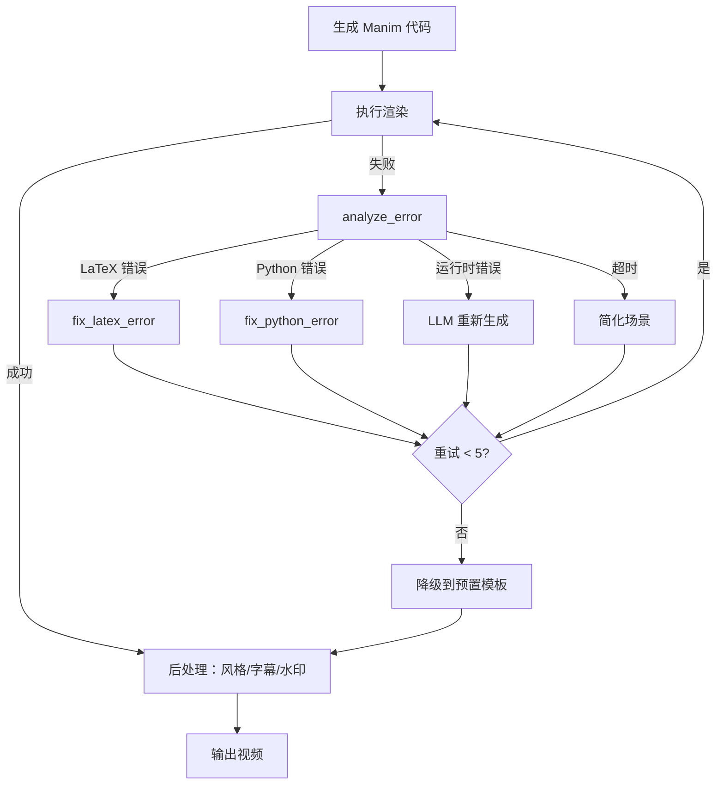

# 数学教学动画 Skill + MCP 完整方案（v3）

## 一、项目愿景

一个**面向小白的全能数学教学动画工具**，让任何人都能轻松制作 3Blue1Brown 风格的数形结合教学动画。

- **多种输入**：文字、LaTeX、PDF 试卷、图片截图、文章段落
- **多种部署**：Cursor Skill、MCP Server、网页版、Docker、桌面应用、云端
- **个性化**：6 种视觉风格、5 级受众难度、自定义品牌、用户偏好记忆
- **小白友好**：一键部署、说人话交互、出错自动修复、有模板可选

---

## 二、整体架构

```mermaid
flowchart TB
    subgraph input [多种输入]
        text["文字/口语描述"]
        latex["LaTeX 公式"]
        pdf["PDF 文件"]
        image["图片/截图"]
        article["文章/教材"]
    end

    subgraph preprocessing [输入预处理]
        detect["自动识别类型"]
        pdfParse["PDF 提取"]
        ocrParse["图片 OCR"]
        fixOcr["LLM 修正乱码"]
        normalize["统一格式化"]
    end

    subgraph brain [AI 编排层]
        classify["理解意图"]
        plan["场景规划"]
        style["应用风格预设"]
        generate["生成 Manim 代码"]
        templateMatch["匹配模板"]
    end

    subgraph engine [渲染引擎]
        render["Manim 渲染"]
        selfHeal["自修复"]
        postProcess["后处理：水印/字幕/TTS"]
        output["MP4/GIF/WebM"]
    end

    subgraph deploy [多种部署方式]
        cursorSkill["Cursor Skill"]
        mcpServer["MCP Server"]
        webUI["Web 网页版"]
        dockerDeploy["Docker 容器"]
        desktopApp["桌面应用"]
    end

    input --> preprocessing
    preprocessing --> brain
    brain --> engine
    engine --> output
    deploy -.->|都调用同一套| engine
```

---

## 三、技术选型与工具

### 3.1 核心引擎

- **ManimCE v0.20.1** -- [ManimCommunity/manim](https://github.com/ManimCommunity/manim) (37,500+ Stars)
- **manim-physics v0.4.0** -- [Matheart/manim-physics](https://github.com/Matheart/manim-physics) 物理模拟
- **manim-themes** -- 预设主题插件（Catppuccin、Tokyo Night、Material Design 等）

### 3.2 输入处理

- **MinerU** (58K Stars) -- PDF 公式提取，中文最佳
- **Pix2Text** (3.1K Stars) -- 图片 OCR + 公式识别，Mathpix 免费替代
- **PaddleOCR PP-FormulaNet_plus** -- 中文公式 BLEU 90.64%

### 3.3 参考项目

- [Math-To-Manim](https://github.com/HarleyCoops/DeepSeek-Manim-Animation-Generator) (1,758 Stars) -- 六代理教学管道
- [manim_skill](https://github.com/adithya-s-k/manim_skill) (703 Stars) -- Cursor Agent Manim 技能包
- [abhiemj/manim-mcp-server](https://github.com/abhiemj/manim-mcp-server) (574 Stars) -- MCP Server 基础
- [ManimCat](https://github.com/Wing900/ManimCat) (215 Stars) -- 中文友好，自动修复
- [manim-web](https://github.com/maloyan/manim-web) (329 Stars) -- TypeScript 浏览器端 Manim
- [arXivisual](https://github.com/rajshah6/arXivisual) -- 论文转动画，Modal.com 无服务器渲染

---

## 四、MCP Server 设计

### 4.1 项目结构

```
math-animation-mcp/
  pyproject.toml                # 发布到 PyPI，支持 uvx 一键运行
  Dockerfile                    # Docker 打包
  docker-compose.yml            # 一键启动
  install.sh                    # Linux/macOS 一键安装
  install.ps1                   # Windows 一键安装
  src/math_animation_mcp/
    server.py                   # MCP Server 主入口（stdio）
    web_server.py               # Web 界面入口（Gradio/Streamlit）
    tools/
      input_tools.py            # 输入处理（5 个工具）
      render_tools.py           # 渲染执行（3 个工具）
      template_tools.py         # 模板管理（3 个工具）
      repair_tools.py           # 自修复（3 个工具）
      personalization_tools.py  # 个性化（4 个工具）  <-- 新增
      export_tools.py           # 导出分享（3 个工具）  <-- 新增
    templates/                  # 预置模板库
      geometry/                 # 几何（勾股、圆锥曲线、立体几何...）
      algebra/                  # 代数（二次方程、函数图像、数列...）
      calculus/                 # 微积分（极限、导数、积分...）
      trigonometry/             # 三角函数（单位圆、图像变换...）
      statistics/               # 统计概率（正态分布、概率树...）
      physics/                  # 物理（抛体、电磁、波动...）
      cs/                       # CS（排序、树、图...）
    styles/                     # 风格预设  <-- 新增
      three_blue_one_brown.py   # 3B1B 风格（深色背景，经典配色）
      khan_academy.py           # 可汗学院风格（浅色背景）
      textbook.py               # 教科书风格（正式、极简）
      playful.py                # 趣味风格（多彩，适合低龄）
      dark_tech.py              # 暗色科技风（适合大学/竞赛）
      blackboard.py             # 黑板风格（课堂模拟）
    config/                     # 用户配置  <-- 新增
      default_prefs.yaml        # 默认偏好
      schema.py                 # 配置验证 schema
    utils/
      sandbox.py                # 安全执行沙箱
      file_manager.py           # 输出文件管理
      chinese_support.py        # 中文字体 + ctex
      ffmpeg_postprocess.py     # FFmpeg 后处理（水印、字幕、压缩）
```

### 4.2 MCP 工具清单（共 21 个）

**输入处理（5 个）**：

- `detect_input_type(content)` -- 自动判断：数学题/动画描述/LaTeX/修改请求/文章段落
- `parse_pdf(file_path, page_range?)` -- PDF 提取文字和公式
- `parse_image(file_path)` -- 图片 OCR + 公式识别
- `fix_ocr_errors(text)` -- LLM 修正 OCR 乱码
- `normalize_content(raw_text)` -- 统一为结构化 JSON

**渲染执行（3 个）**：

- `render_animation(code, quality, format, style?)` -- Manim 渲染
- `preview_scene(code)` -- 480p 快速预览
- `render_gif(code, duration?)` -- GIF 导出

**模板管理（3 个）**：

- `list_templates(category?, difficulty?)` -- 按分类和难度列出模板
- `get_template(template_id)` -- 获取模板源码
- `search_templates(keyword)` -- 关键词搜索

**自修复（3 个）**：

- `analyze_error(code, error_msg)` -- 错误类型分析
- `fix_latex_error(code, error_msg)` -- LaTeX 修复
- `fix_python_error(code, error_msg)` -- Python 修复

**个性化（4 个）** -- 新增：

- `set_style(style_name)` -- 切换风格预设（3b1b/khan/textbook/playful/dark_tech/blackboard）
- `set_preferences(prefs)` -- 设置用户偏好（默认质量/速度/字号/语言/受众级别等）
- `get_preferences()` -- 读取当前偏好
- `set_branding(logo?, watermark?, intro_text?)` -- 品牌化设置（Logo、水印、片头文字）

**导出分享（3 个）** -- 新增：

- `export_video(file_path, format, aspect_ratio?)` -- 导出多格式（MP4/WebM/GIF）+ 多比例（16:9/9:16 竖屏/1:1 方形/4:3）
- `add_subtitles(video_path, text)` -- 添加字幕
- `add_tts_narration(video_path, script, voice?)` -- TTS 语音旁白

---

## 五、个性化系统

### 5.1 六种风格预设

| 风格 | 背景色 | 配色特点 | 适合场景 |
|------|--------|----------|----------|
| **3Blue1Brown** | 深灰 #1C1C1C | 蓝+黄+绿经典配色 | 科普/大学教学 |
| **可汗学院** | 白色 #FFFFFF | 柔和色彩，高对比 | 中小学教学 |
| **教科书** | 浅灰 #F5F5F5 | 黑+灰+少量强调色 | 正式/论文 |
| **趣味多彩** | 浅黄 #FFF8E1 | 彩虹色系，圆角 | 小学/低龄 |
| **暗色科技** | 纯黑 #000000 | 霓虹蓝+紫+绿 | 大学/竞赛/CS |
| **黑板风** | 深绿 #2D5016 | 白色粉笔感文字 | 课堂模拟 |

### 5.2 五级受众适配

| 级别 | 受众 | 动画速度 | 字号 | 步骤详细度 | 术语级别 |
|------|------|----------|------|------------|----------|
| L1 | 小学 | 慢（0.5x） | 特大 | 极详细，每步停顿 | 生活用语 |
| L2 | 初中 | 较慢（0.7x） | 大 | 详细 | 基础术语 |
| L3 | 高中 | 正常（1.0x） | 中 | 适中 | 标准术语 |
| L4 | 大学 | 较快（1.2x） | 中 | 精简 | 专业术语 |
| L5 | 竞赛/研究 | 快（1.5x） | 小 | 最精简 | 高级术语 |

### 5.3 用户偏好配置文件

```yaml
# manim_prefs.yaml -- 用户个性化配置
style:
  preset: "three_blue_one_brown"    # 风格预设
  custom_colors:                     # 自定义颜色（可选覆盖）
    primary: "#3B82F6"
    secondary: "#F59E0B"
    accent: "#10B981"

audience:
  level: 3                           # 受众级别 1-5
  language: "zh-CN"                  # 语言

output:
  default_quality: "medium"          # low/medium/high/4k
  default_format: "mp4"             # mp4/gif/webm
  aspect_ratio: "16:9"             # 16:9/9:16/1:1/4:3
  max_duration: 120                 # 最大时长（秒）

animation:
  speed_multiplier: 1.0             # 全局速度倍率
  pause_between_steps: 1.0          # 步骤间停顿（秒）
  font_scale: 1.0                   # 字号缩放

branding:
  watermark: ""                     # 水印文字
  logo_path: ""                     # Logo 图片路径
  intro_text: ""                    # 片头文字
  outro_text: ""                    # 片尾文字
```

---

## 六、多种部署方式

### 6.1 部署方式总览



### 6.2 方式 1：网页版（最小白）

基于 Gradio 构建，零安装，打开浏览器即用。

```bash
# 本地启动
python -m math_animation_mcp.web_server
# 浏览器打开 http://localhost:7860
```

网页界面功能：
- 文本输入框（支持拖拽上传 PDF/图片）
- 风格选择器（6 种预设可视化预览）
- 受众级别滑块
- 实时预览窗口
- 一键下载按钮（MP4/GIF）
- 历史记录面板

可一键部署到 Hugging Face Spaces（免费）或 Gradio Cloud。

### 6.3 方式 2：Docker 一键启动（推荐跨平台方案）

```bash
# 一条命令启动全部服务（自动下载镜像，包含所有依赖）
docker compose up -d

# 或者直接 docker run
docker run -p 7860:7860 -v ./output:/app/output your-name/math-animation-mcp
```

Dockerfile 基于 `manimcommunity/manim` 官方镜像，额外安装：
- 中文字体（思源宋体/黑体）
- ctex LaTeX 包
- Pix2Text / MinerU（OCR）
- FFmpeg（后处理）
- Gradio（Web 界面）

docker-compose.yml：
```yaml
services:
  math-animation:
    image: your-name/math-animation-mcp:latest
    ports:
      - "7860:7860"    # Web 界面
    volumes:
      - ./output:/app/output          # 输出文件
      - ./config:/app/config          # 用户配置
    environment:
      - DEFAULT_STYLE=three_blue_one_brown
      - DEFAULT_QUALITY=medium
      - LANG=zh_CN.UTF-8
```

### 6.4 方式 3：桌面扩展 .mcpb（Claude Desktop 用户）

打包为 Anthropic 的 .mcpb 格式（原 DXT），双击安装到 Claude Desktop：

```bash
# 开发者打包
npx @anthropic-ai/mcpb init
npx @anthropic-ai/mcpb pack
# 产出 math-animation.mcpb 文件

# 用户安装
# 下载 .mcpb 文件 -> 双击 -> 点击安装 -> 完成
```

### 6.5 方式 4：uvx 一键运行（Python 用户推荐）

发布到 PyPI，用户无需手动安装依赖：

```bash
# 一条命令运行 MCP Server
uvx math-animation-mcp

# 或者启动 Web 界面
uvx math-animation-mcp --web

# 或者 pip 安装
pip install math-animation-mcp
```

### 6.6 方式 5：Cursor MCP 配置

```json
{
  "mcpServers": {
    "math-animation": {
      "command": "uvx",
      "args": ["math-animation-mcp"],
      "env": {
        "OUTPUT_DIR": "./animation_output",
        "DEFAULT_STYLE": "three_blue_one_brown"
      }
    }
  }
}
```

### 6.7 方式 6：Cursor Skill（纯指令，无需 MCP）

```
~/.cursor/skills/math-animation/
  SKILL.md
  reference.md
  examples.md
```

Skill 模式下 AI 直接在项目中生成 Manim Python 文件并调用系统 Manim 渲染，不依赖 MCP Server，但需要本地已安装 ManimCE。

### 6.8 方式 7：云端无服务器（生产级）

使用 Modal.com 按需渲染，参考 arXivisual 架构：

```python
import modal
image = (
    modal.Image.debian_slim(python_version="3.13")
    .apt_install("ffmpeg", "libcairo2-dev", "texlive-full")
    .pip_install("manim", "pix2text")
)

@app.function(image=image, timeout=120)
def render_scene(code: str, style: str = "3b1b"):
    # 在隔离容器中渲染
    ...
```

优势：零运维、按用量付费、秒级扩缩容。

---

## 七、一键安装脚本

### 7.1 Linux / macOS

```bash
# 一键安装（自动检测系统、安装依赖、配置环境）
curl -fsSL https://install.cat/your-name/math-animation-mcp | bash
```

`install.sh` 核心逻辑：
1. 检测操作系统（macOS/Ubuntu/Debian/Fedora/Arch）
2. 安装系统依赖：
   - macOS: `brew install manim ffmpeg`
   - Ubuntu: `apt install texlive ffmpeg libcairo2-dev`
3. 安装 Python 包：`pip install math-animation-mcp`
4. 下载中文字体
5. 运行验证测试
6. 打印使用指南

### 7.2 Windows

```powershell
# PowerShell 一键安装
irm https://install.cat/your-name/math-animation-mcp/windows | iex
```

`install.ps1` 核心逻辑：
1. 检查/安装 Chocolatey
2. `choco install manimce ffmpeg python`
3. `pip install math-animation-mcp`
4. 配置中文字体
5. 验证 + 使用指南

### 7.3 通用 Docker（任何平台）

```bash
# 最最简单的方式：什么都不用装，只需要 Docker
docker run -it -p 7860:7860 your-name/math-animation-mcp
# 打开 http://localhost:7860 开始使用
```

---

## 八、小白教程体系

### 8.1 30 秒快速开始（README 首屏）

```
# 三种方式，选一种：

# 方式 A：有 Docker？一条命令搞定
docker run -p 7860:7860 your-name/math-animation-mcp
# 打开浏览器 http://localhost:7860

# 方式 B：有 Python？
pip install math-animation-mcp
math-animation-mcp --web

# 方式 C：用 Cursor？
# 复制 MCP 配置到 .cursor/mcp.json（见上文）
```

### 8.2 文档结构

```
docs/
  getting-started/
    30-second-quickstart.md    # 30 秒开始
    install-macos.md           # macOS 详细安装（含截图）
    install-windows.md         # Windows 详细安装（含截图）
    install-linux.md           # Linux 详细安装
    install-docker.md          # Docker 安装（推荐）
    first-animation.md         # 你的第一个动画（手把手）
  tutorials/
    basic-math-animation.md    # 基础：文字 -> 动画
    pdf-to-animation.md        # 进阶：PDF 试卷 -> 动画
    image-to-animation.md      # 进阶：截图 -> 动画
    customize-style.md         # 个性化：换风格/颜色
    batch-generation.md        # 高级：批量生成
    add-narration.md           # 高级：添加语音旁白
  faq/
    common-errors.md           # 常见错误及解决
    chinese-support.md         # 中文显示问题
    performance-tips.md        # 渲染速度优化
```

### 8.3 交互式教程（可选增强）

使用 [TutorialKit](https://tutorialkit.dev) 构建在线交互式教程：
- 用户在浏览器中输入描述
- 实时看到生成的 Manim 代码
- 实时看到渲染的动画预览
- 每步都有提示和说明

---

## 九、Cursor Skill 设计

### 9.1 SKILL.md 核心工作流

```yaml
---
name: math-animation
description: >-
  Generate 3Blue1Brown-style math teaching animations from text, LaTeX,
  PDF, or images. Supports Chinese math exams, personalized styles, and
  multiple output formats. Use when user wants to create math/physics/CS
  animations, visualize equations, or make teaching videos.
---
```

**引导式工作流**：

```
Step 1: 识别输入
  - 文件 → parse_pdf / parse_image
  - 文字 → detect_input_type
  - OCR 乱码 → fix_ocr_errors
  - 统一 → normalize_content

Step 2: 理解意图
  - 数学题 → 解题动画
  - LaTeX → 公式可视化
  - 概念 → 数形结合
  - 文章 → 知识点逐段动画
  - 修改 → 增量调整

Step 3: 应用个性化
  - 读取用户偏好 get_preferences()
  - 应用风格预设
  - 适配受众级别

Step 4: 匹配模板 + 生成代码
  - search_templates → 基于模板或从零生成
  - 使用 ctex 中文支持
  - 遵循 reference.md API 规范

Step 5: 渲染与自修复
  - preview_scene → 快速预览
  - 确认后 render_animation
  - 失败 → analyze_error → fix → 重试（最多 5 次）
  - 熔断 → 降级到模板

Step 6: 后处理与输出
  - export_video 导出指定格式/比例
  - 可选 add_subtitles / add_tts_narration
  - 应用品牌化（水印/Logo）
```

### 9.2 小白使用场景

**场景 1：直接说话**
```
用户：帮我做一个勾股定理的证明动画
AI → 匹配模板 → 应用偏好风格 → 生成 → 预览 → 输出
```

**场景 2：上传 PDF 试卷**
```
用户：@2025高考数学.pdf 帮我把第 15 题做成讲解动画
AI → PDF 解析 → 提取第 15 题 → OCR 修正 → 理解题意 → 解题动画
```

**场景 3：拍照/截图**
```
用户：@题目.png 这道题动画讲解一下
AI → 图片 OCR → 公式识别 → 修正 → 动画
```

**场景 4：给文章**
```
用户：把这段关于傅里叶变换的文字做成动画教学视频
AI → 提取知识点 → 分场景 → 逐段动画 → 可选加旁白
```

**场景 5：口语修改**
```
用户：动画太快了，换成黑板风格，字再大点
AI → 理解修改 → set_style("blackboard") → 调速 → 调字号 → 重渲染
```

**场景 6：个性化设置**
```
用户：以后默认用可汗学院风格，受众是初中生
AI → set_preferences({style: "khan_academy", level: 2}) → 保存
```

**场景 7：批量生成**
```
用户：@期末试卷.pdf 把所有选择题都做成动画
AI → PDF 解析 → 逐题提取 → 批量生成 → 打包输出
```

---

## 十、自修复管道



---

## 十一、实施路线

### 阶段一：MVP（3-5 天）
- 环境搭建：ManimCE + MCP SDK + 中文字体
- 核心 MCP 工具：render_animation + preview_scene + render_gif
- 5-10 个基础模板
- SKILL.md 基础工作流
- 验证：文字输入 -> 动画输出

### 阶段二：输入扩展（3-5 天）
- 集成 Pix2Text 实现 PDF/图片 OCR
- OCR 乱码修正
- 输入类型自动检测
- 更多模板（覆盖高考主要知识点）

### 阶段三：个性化（2-3 天）
- 6 种风格预设实现
- 5 级受众适配
- 用户偏好持久化（manim_prefs.yaml）
- 品牌化（水印/Logo）

### 阶段四：多部署方式（3-5 天）
- Gradio Web 界面
- Dockerfile + docker-compose
- PyPI 发布（uvx 支持）
- 一键安装脚本（install.sh / install.ps1）
- .mcpb 桌面扩展打包

### 阶段五：体验打磨（2-3 天）
- 自修复管道完善
- 导出多格式/多比例
- 小白教程文档
- 常见错误 FAQ

### 阶段六：高级功能（持续迭代）
- TTS 语音旁白 + 字幕
- 批量生成（整张试卷）
- RAG 索引 Manim 文档
- 云端无服务器部署（Modal.com）
- 物理/CS 动画扩展
- 文章/教材 -> 系列教学视频

---

## 十二、开源资源汇总

**核心引擎**：
- [ManimCE](https://github.com/ManimCommunity/manim) (37.5K Stars) -- 动画渲染
- [manim-physics](https://github.com/Matheart/manim-physics) -- 物理模拟
- [manim-web](https://github.com/maloyan/manim-web) (329 Stars) -- 浏览器端 TypeScript Manim

**AI + Manim**：
- [Math-To-Manim](https://github.com/HarleyCoops/DeepSeek-Manim-Animation-Generator) (1,758 Stars)
- [Generative Manim](https://github.com/marcelo-earth/generative-manim) (815 Stars)
- [manim_skill](https://github.com/adithya-s-k/manim_skill) (703 Stars)
- [ManimCat](https://github.com/Wing900/ManimCat) (215 Stars)
- [manim-generator](https://github.com/makefinks/manim-generator) (95 Stars)

**MCP Server**：
- [abhiemj/manim-mcp-server](https://github.com/abhiemj/manim-mcp-server) (574 Stars)
- [paulnegz/manim-mcp](https://github.com/paulnegz/manim-mcp)
- [pdf-mcp](https://github.com/jztan/pdf-mcp) -- PDF 处理
- [tesseract-mcp-server](https://github.com/maximdx/tesseract-mcp-server) -- OCR

**输入处理**：
- [MinerU](https://github.com/opendatalab/MinerU) (58K Stars) -- PDF 公式提取
- [Pix2Text](https://github.com/breezedeus/Pix2Text) (3.1K Stars) -- 图片公式 OCR
- [PaddleOCR](https://github.com/PaddlePaddle/PaddleOCR) -- 中文 OCR

**部署工具**：
- [MCP Python SDK](https://github.com/modelcontextprotocol/python-sdk) -- MCP 开发
- [Docker manimcommunity/manim](https://hub.docker.com/r/manimcommunity/manim) -- 官方 Docker
- [install.cat](https://install.cat) -- 一键安装脚本托管
- [Anthropic MCPB](https://github.com/anthropics/dxt/) -- 桌面扩展打包
- [arXivisual](https://github.com/rajshah6/arXivisual) -- Modal.com 云渲染参考
